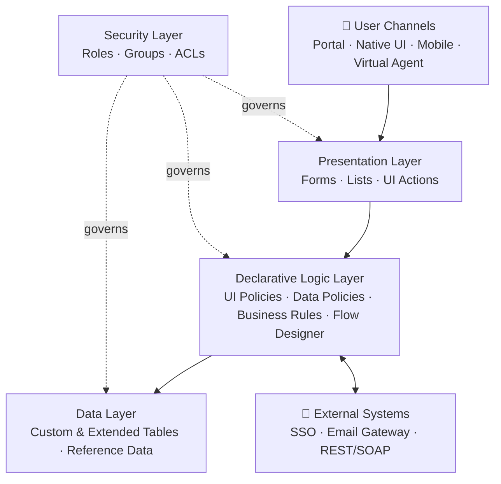

# ServiceNow Design Approach Document

| Attribute | Value |
|:----------|:------|
| Project / Solution | `<Solution Name>` |
| Prepared By | Solution Architecture Practice |
| Version | 1.0 |
| Status | Draft – Awaiting CONTEXT Input |
| Classification | Internal – Confidential |

---

> **Input Context Notice**
> The CONTEXT provided in the prompt contained a placeholder and no validated business requirements. In accordance with the non-hallucination rule, every requirement-specific decision in this document is marked `Not Provided`. The structure, methodology, and approach principles remain fully reusable and RAG-indexable.

---

## 1. Executive Summary

This document defines the **design approach** for implementing the `<Solution Name>` capability on the ServiceNow platform. It is not a full solution design document; rather, it sets out **how** the solution will be designed, **which platform components** will be used, and **why**, providing delivery teams with a clear, defensible blueprint before detailed build specifications are produced.

The approach is strictly **configuration-only** — no custom scripting is proposed. Logic is expressed in plain English and mapped to platform-native, declarative capabilities.

---

## 2. Business Understanding

### 2.1 Business Need
*Not Provided*

### 2.2 Problem Statement
*Not Provided*

### 2.3 Expected Outcomes
| # | Outcome | Success Measure |
|:--:|:--------|:----------------|
| 1 | *Not Provided* | *Not Provided* |
| 2 | *Not Provided* | *Not Provided* |

---

## 3. Design Principles

The following principles govern every design decision in this document. They are applied in order of precedence when trade-offs arise.

| # | Principle | Implication |
|:--:|:----------|:------------|
| 1 | **Configuration over Customization** | Use out-of-box functionality before considering alternatives. |
| 2 | **Declarative over Scripted** | UI Policy, Data Policy, and Flow Designer are preferred; scripting is excluded in this engagement. |
| 3 | **Extend, Don't Replace** | Extend standard tables (e.g., `task`) to inherit platform features. |
| 4 | **Secure by Default** | Every artefact has explicit roles, groups, and ACLs. |
| 5 | **Upgrade-Safe** | No modification of out-of-box records; use scoped applications. |
| 6 | **Observable** | Every process leaves an audit trail; reporting is built in from day one. |

---

## 4. Requirement Breakdown

Requirements are grouped into logical modules, each of which maps cleanly to a ServiceNow capability.

| Module | Purpose | Primary ServiceNow Capability |
|:-------|:--------|:------------------------------|
| Intake & Request Capture | Gather structured input from users | Service Portal, Record Producers, Forms |
| Qualification & Validation | Validate input and enforce rules | UI Policies, Data Policies |
| Processing & Fulfillment | Route, approve, and execute work | Flow Designer, Assignment Rules |
| Notification & Communication | Inform stakeholders of progress | Email Notifications, Events |
| Reporting & Oversight | Provide visibility and metrics | Reports, Dashboards, Performance Analytics |
| Access Governance | Enforce who sees and does what | Roles, Groups, ACLs |

*Module-level requirement population: Not Provided.*

---

## 5. Design Approach – Component Mapping

Each functional area is mapped to a specific platform component with clear justification.

| Functional Area | ServiceNow Component | Justification |
|:----------------|:---------------------|:--------------|
| Data persistence | Extended table on `task` (or appropriate parent) | Inherits assignment, SLA, audit, and reporting out of the box. |
| User interaction | Standard Form + Service Portal page | Native, responsive, ACL-aware. |
| Field behaviour (show/hide/mandatory) | UI Policy | Declarative, upgrade-safe, no scripting. |
| Server-side validation | Data Policy | Enforced on UI, import sets, and web services consistently. |
| Business logic on record events | Business Rule (condition-driven, no script) | Executes logic at the correct lifecycle stage (Before/After/Async). |
| Process orchestration | Flow Designer | Modern low-code orchestration; ServiceNow's strategic tool. |
| Actionable buttons / links | UI Action (condition-driven) | Declarative, respects ACLs. |
| Security | Roles + Groups + ACLs | Standard, scalable, auditable. |
| Communication | Email Notifications via record events | Native delivery with subscription management. |
| Routing | Assignment Rules / Data Lookup Rules | Declarative alternative to scripted routing. |

---

## 6. Solution Architecture (Single View)

The solution operates across five logical layers. External integrations and channels connect through defined, governed entry points.

Note: Image Required

*This is the only architectural diagram in this document; all other design detail is expressed through tables and plain-English logic to maintain clarity for reviewers and implementers.*

---

## 7. Configuration Design

### 7.1 Table Design

| Attribute | Value |
|:----------|:------|
| Table Name | *Not Provided* |
| Parent Table | *Not Provided* (recommend `task`) |
| Application Scope | *Not Provided* |
| Auditing | Enabled |
| Number Prefix | *Not Provided* |

**Field Specification**

| Field Label | Field Name | Type | Mandatory | Reference | Description |
|:------------|:-----------|:----:|:---------:|:---------:|:------------|
| *Not Provided* | *Not Provided* | *Not Provided* | — | — | *Not Provided* |

**Standards Applied**
- Field names in lowercase snake_case.
- Reference fields target stable, existing tables only.
- Custom fields prefixed per application scope convention.

### 7.2 Form Design

| Section | Fields (High-level) | Visibility Rule |
|:--------|:--------------------|:----------------|
| Header / Summary | Number, Short Description, State, Priority | Always visible |
| Classification | Category, Sub-Category, Service | Always visible |
| Assignment | Assignment Group, Assigned To | Visible after qualification |
| Resolution | Close Code, Resolution Notes, Closed By | Visible when State ≥ Resolved |

### 7.3 UI Policies

| Policy Name | Condition | Action on TRUE | Action on FALSE |
|:------------|:----------|:---------------|:----------------|
| *Not Provided* | *Not Provided* | Set field mandatory / visible / read-only | Reverse behaviour |

### 7.4 UI Actions

| Action Name | Table | Placement | Condition | Purpose |
|:------------|:------|:----------|:----------|:--------|
| *Not Provided* | *Not Provided* | Form / List / Related Link | *Not Provided* | *Not Provided* |

### 7.5 Business Rules

| Name | Type | When | Order | Condition | Logic (Plain English) |
|:-----|:----:|:----:|:----:|:----------|:----------------------|
| *Not Provided* | Before / After / Async | Insert / Update | 100 | *Not Provided* | *Not Provided* |

**Type Guidance**
- **Before BR** — use for field defaulting and validation prior to commit.
- **After BR** — use for creating related records after the primary commit.
- **Async BR** — use for heavy processing that must not block the user.
- **Display BR** — use to prepare read-only data for the form load.

### 7.6 Flow Designer

| Flow Name | Trigger | Condition | Outcome |
|:----------|:--------|:----------|:--------|
| *Not Provided* | Record Created / Updated | *Not Provided* | *Not Provided* |

**Standard Flow Pattern (applied once requirements are known)**
1. Trigger on record event.
2. Validate and enrich input using Look Up Record actions.
3. Branch logic using conditional paths.
4. Execute fulfilment actions (create task, update record, send notification).
5. Wait for approval where required.
6. Close out, log audit, and notify stakeholders.

### 7.7 Access Control (ACL)

| Table / Field | Operation | Role Required | Condition |
|:--------------|:---------:|:--------------|:----------|
| *Not Provided* | read / write / create / delete | *Not Provided* | *Not Provided* |

### 7.8 Notifications

| Notification Name | Trigger Event | Recipients | Purpose |
|:------------------|:--------------|:-----------|:--------|
| *Not Provided* | *Not Provided* | *Not Provided* | *Not Provided* |

### 7.9 Client Scripts *(Purpose Only – No Code)*

Client scripts are used only where UI Policy cannot satisfy the requirement. Each entry must state why UI Policy is insufficient.

| Name | Type | Purpose | Reason UI Policy is Insufficient |
|:-----|:----:|:--------|:---------------------------------|
| *Not Provided* | onLoad / onChange / onSubmit | *Not Provided* | *Not Provided* |

*List all the required components like the above.*
---

## 8. Logic Definitions (Plain English)

All business logic is expressed declaratively in plain English. No JavaScript is permitted in this engagement.

| # | Scenario | Logic Description |
|:--:|:---------|:------------------|
| 1 | *Example format* | "When a record is created on the custom table and Priority is High, set Assignment Group to 'Tier-2 Support' and flag Escalation Required." |
| 2 | *Not Provided* | *Not Provided* |
| 3 | *Not Provided* | *Not Provided* |

---

## 9. Assumptions & Constraints

### 9.1 Assumptions
- The target ServiceNow instance runs a supported release family.
- All required plugins and IntegrationHub spokes are licensed and active.
- Identity and SSO integration is operational.
- Master data (users, groups, locations) is accurate and current.

### 9.2 Constraints
- No custom scripting (JavaScript) is permitted.
- Only configuration-level, platform-native components are used.
- No modification of out-of-box records is allowed; scoped applications are used instead.

### 9.3 Open Items Awaiting CONTEXT
| # | Missing Input | Blocks |
|:--:|:--------------|:-------|
| 1 | Validated business requirements | All configuration decisions |
| 2 | Role and persona matrix | ACL and role design |
| 3 | Integration catalogue | Flow Designer integration steps |
| 4 | SLA / OLA definitions | SLA configuration |
| 5 | Data migration scope | Transform maps |

---

## 10. Design Summary

### 10.1 Approach in One Paragraph
The solution will be delivered as a **scoped application** extending standard ServiceNow tables. User interaction occurs through **Forms** and the **Service Portal**, governed by **UI Policies** for field behaviour and **Data Policies** for validation. Business logic executes via **condition-driven Business Rules** and **Flow Designer**, with no custom scripting. Security is enforced through **Roles, Groups, and ACLs**. Communications are delivered by **standard Notifications** tied to record events. Reporting is served by **native Reports and Dashboards**, supplemented by Performance Analytics where licensed.

### 10.2 Key Design Decisions
| # | Decision | Rationale |
|:--:|:---------|:----------|
| 1 | Flow Designer over legacy Workflow Editor | Strategic, low-code, long-term supported. |
| 2 | UI Policy over Client Script | Declarative, upgrade-safe, requires no code. |
| 3 | Extend `task` (or equivalent) rather than build standalone | Inherits SLA, assignment, audit, and reporting. |
| 4 | Data Policy over Before Business Rule for validation | Works consistently across UI, import, and web services. |
| 5 | Scoped Application | Isolation, packaged deployment, governance-ready. |

### 10.3 Next Steps
1. Retrieve validated requirements from the RAG knowledge base.
2. Populate every `Not Provided` field with specific content.
3. Conduct design review with Business, Architecture, and Platform stakeholders.
4. Baseline this document and transition to detailed build specifications.

---
